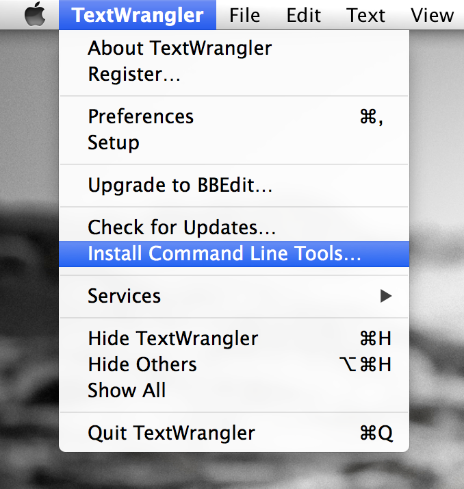

Personal computer setup
=======================

This part of the tutorial covers computer setup for first-time bioinformatic users or for new computers. If you have already compiled or installed packages through Command Line Interface don't loose time with this section.

 
.. Note::

 `Use this reference card of useful commands (PDF) <http://practicalcomputing.org/files/PCfB_Appendices.pdf>`_

Linux
-----

You guys don't need an introduction on how to set up your computer?

Mac OSX
-------

Update your OS
++++++++++++++

Here is `how <http://support.apple.com/kb/HT1338?viewlocale=en_US&locale=en_US>`_ and the current version is Mavericks 10.9.2.

Install Apple's Command Line Tools
++++++++++++++++++++++++++++++++++

Open the application *Terminal* and type:

.. code-block:: bash

 gcc
 
Although the prompt message is a bit confusing, clicking **install** and following the instructions will install **Command Line Tools**, not *Xcode* (unless you're developing Apps, you don't need *Xcode*, save some space on your hard disk!).

Install the `wget <https://www.gnu.org/software/wget/>`_ utility
++++++++++++++++++++++++++++++++++++++++++++++++++++++++++++++++

This software will save you a lot of time in the future, you want it! `Download it <http://ftp.gnu.org/gnu/wget/>`_, but first look for the *.tar.gz* file with the latest release (wget-1.15.tar.gz). The file is in your **Downloads** directory, copy & paste the commands below (one at a time):

.. code-block:: bash

 cd ~/Downloads
 curl -O http://ftp.gnu.org/gnu/wget/wget-1.15.tar.gz # change the '-x.xx.tar.gz' number with the latest release version.
 tar -zxvf wget-1.15.tar.gz
 cd wget-1.15
 ./configure
 

.. Warning::

 An error may occur : ``configure: error: --with-ssl was given, but GNUTLS is not available.`` If this is the case, use this command instead:

 .. code-block:: bash

  ./configure --with-ssl=openssl

Almost finished with wget, continue with:

.. code-block:: bash

 make
 sudo make install                     # will prompt you to enter your password
 cd ..                                 # goes up to the enclosing directory
 test installation wget --help         # Yes, it worked!

.. Warning::

 To remove the folder and downloaded package use the ``sudo rm -R`` command, but be very careful with this command because the content is deleted FOREVER, it doesn't go in the trash...

 .. code-block:: bash

  sudo rm -R wget-1.15 wget-1.15.tar.gz  # delete the wget folder and package

 
Update your computer's compiler
++++++++++++++++++++++++++++++

You need to find your computer's `compiler <http://en.wikipedia.org/wiki/Compiler>`_, delete it and install a newer version. Apple is now using `Clang <http://en.wikipedia.org/wiki/Clang>`_ as it's default compiler. However, Genotype-by-Sequencing analysis using **Stacks** and other software using parallel computing requires `GNU Compiler Collection (GCC) <http://en.wikipedia.org/wiki/GNU_Compiler_Collection>`_ with `OpenMP <http://en.wikipedia.org/wiki/OpenMP>`_ enabled. The version pre-installed on Apple's computer doesn't support OpenMP.

**Find**
 
.. code-block:: bash

 which gcc # The output should be `/usr/bin/gcc`.
  
**Delete**
 
.. code-block:: bash
 
 cd /usr/bin
 sudo rm cpp g++ gcc gcov
  
**Install the new compiler** `(gcc-4.9-bin.tar.gz) <http://hpc.sourceforge.net>`_ for Mavericks only.
 
.. code-block:: bash

 cd ~/Downloads
 wget http://prdownloads.sourceforge.net/hpc/gcc-4.9-bin.tar.gz
 sudo tar -zxvf gcc-4.9-bin.tar.gz -C/  # This will install the compiler in `/usr/local/bin`
 sudo rm gcc-4.9-bin.tar.gz # to remove the package from your Downloads directory

.. Note:: Verify the installation with the command ``gcc -v``

Install `TextWrangler <http://www.barebones.com/products/textwrangler/>`_
+++++++++++++++

TextWrangler is a free text editor that will help you save time. Once installed, go in the Apple Menu bar -> TextWrangler -> Install Command Line Tools

Install `pip <http://www.pip-installer.org/en/latest/index.html>`_
++++++++++++++++++++++++++++++++++++++++++++++++++++++++++++++++++

Create a new file in TextWrangler ``cmd-n`` and put all the content (``cmd-a``, ``cmd-c``) of `this link <https://raw.github.com/pypa/pip/master/contrib/get-pip.py>`_ in it (``cmd-v``). Save the file in your download folder as: **get-pip.py**

Run this from you Terminal:

.. code-block:: bash

 cd ~/Downloads
 ./get-pip.py
 
 pip install -U pip   # to upgrade

Install `boto <http://boto.readthedocs.org/en/latest/>`_
++++++++++++++++++++++++++++++++++++++++++++++++++++++++

Boto is a Python integrated interface to the services offered by Amazon Web Services. We will use it to upload data to the instance. Run this command to install it:

.. code-block:: bash

 pip install boto

We will configure boto later in the tutorial.

 
.. Note::

 - ./configure = configure everything before installation
 - `make <http://www.gnu.org/software/make/manual/make.html>`_ = connect libraries and the source before make install
 - make install = to build (compile) source code to create binary files and install the application on our system as configured using ./configure (usually in /usr/local/bin).
 - for more *curl* option type ``curl -h``
 
Save time
---------

**The shell start up script and PATH to programs**

To make things a little easier to talk to your computer, each time you open the *Terminal* a `shell start up scripts <http://en.wikipedia.org/wiki/Bash_(Unix_shell)#Startup_scripts>`_ tells your computer where to look for programs. The path for your programs can be modify in your shell start up script. When your computer is searching for programs, it looks into these `path <http://en.wikipedia.org/wiki/PATH_(variable)>`_:

.. code-block:: bash

 $PATH

The output with new Apple's computers should look like this: ``/usr/bin:/bin:/usr/sbin:/sbin:/usr/local/bin``.

.. Note::

 use the ``pwd`` command to know exactly where you are!

The name of the shell startup file differs across platforms. Depending on OS it is called **~/.bash_profile** and sometimes **~/.profile**. Filename beginning with a dot "." are reserved for the system and are invisible in the Finder.
 
Find your shell start up script with the following command:
 
.. code-block:: bash

 ls -al ~ | grep profile
 
If this returns nothing (blank), you don't have a shell start up script. Create one with this command

.. code-block:: bash

 sudo touch $HOME/.bash_profile

With Mac OSX, use a free text editor like `TextWrangler <http://www.barebones.com/products/textwrangler/>`_ to open or make and modify hidden items (using the option *Show hidden items* on the open file screen). With Linux, use Vi! 

**Keep your start up script open, you will need it in the following sections**

After modifying your shell start up script run the command ``source ~/.bash_profile`` to reload it.

.. Warning::

 **Problems ?**

 1. To help you solve computer related problems and start focusing back on biology, you should get this book: `Practical Computing for Biologists <http://practicalcomputing.org>`_ (go for paper, because the digital edition from Sinauer is useless). 
 2. `Biostar <https://www.biostars.org>`_
 3. `SEQanswers and SEQanswers wiki <http://seqanswers.com>`_
 4. You can always ask `Google <https://www.google.com>`_ for help.
 5. Take some online classes (see our TREE paper for references)

