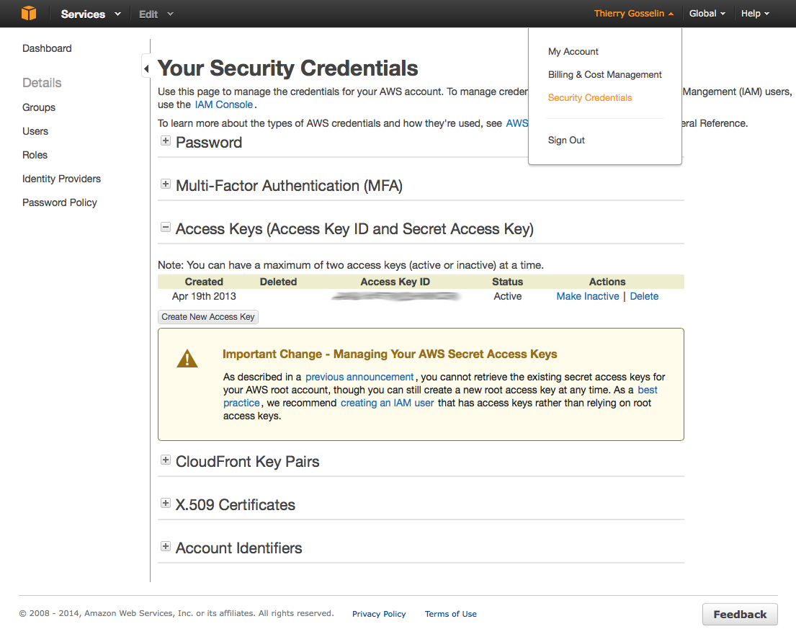

Getting started with Amazon EC2
===============================

Get the tools
-------------
Similar to the tools needed to communicate with your computer, you also need special tools to communicate with Amazon's computers. This part of the tutorial is all about installing and configuring Amazon EC2 command line interface tools (CLI tools), these are shell script written in `Java <http://en.wikipedia.org/wiki/Java_(programming_language)>`_.

.. Warning:: **Prerequisite... Java!** 
 -> Not sure you have Java?

 .. code-block:: bash

  which java
 
 The usual output of this command is ``/usr/bin/java``. If not, you might need to install `Java <http://www.java.com/en/download/index.jsp>`_.
 
 
Configure Java
++++++++++++++

The previous output is also Java's path location in the ``$PATH`` `environment variable <http://en.wikipedia.org/wiki/Environment_variable>`_ written in the start up script, but in most cases this is a *symbolic link*, a shortcut, to the actual program; **symbolic links do not work for Amazon**. Consequently, you need to find where the actual Java program lives on your system and set a new environment variable JAVA_HOME in your start up script.

**Mac OS X:** 

.. code-block:: bash

 /usr/libexec/java_home

.. Warning::

 If the output is: ``No Java runtime present, try --request to install``. Enter the command: ``java --install`` and follow the instructions to download and install JDK from Oracle's website.
 
 **Verify the install** with ``/usr/libexec/java_home`` command.

.. code-block:: bash

 export JAVA_HOME=$(/usr/libexec/java_home)
 
**Linux:** 

Recursively run the ``file`` command on the ``which java`` output until you find the binary.
 
.. code-block:: bash
 
 file $(which java)
 
 output:
 /usr/bin/java: symbolic link to /etc/alternatives/java
 
 file /etc/alternatives/java
 
 output:
 /etc/alternatives/java: symbolic link to /usr/lib/jvm/java-6-openjdk-amd64/jre/bin/java

 file /usr/lib/jvm/java-6-openjdk-amd64/jre/bin/java
 
 output: 
 /usr/lib/jvm/java-6-openjdk-amd64/jre/bin/java: ELF 64-bit LSB executable...

 export JAVA_HOME="/usr/lib/jvm/java-6-openjdk-amd64/jre"
 
**Mac OSX and Linux: Verify your JAVA_HOME setting**

.. code-block:: bash

 $JAVA_HOME/bin/java -version

**Modify your shell start up script**

You want to include the JAVA_HOME environment variable definition to your shell start up script so that it is set every time you log in or spawn a new shell. To do this on Mac OSX, use TextWrangler, copy and paste ``export JAVA_HOME=$(/usr/libexec/java_home)`` to your *.bash_profile* file and reload the shell start up script in the *Terminal*: 

.. code-block:: bash

 source .bash_profile

Amazon EC2 CLI Tools
++++++++++++++++++++

`Download and install the CLI Tools <http://aws.amazon.com/developertools/351>`_

Alternatively, if you are getting fond of the *Terminal*, you can use the *wget* utility installed previously... But first create a folder named *programs* as instructed in `The Simple Fool's Guide of the Palumbi Lab <http://sfg.stanford.edu>`_ (BTW: you should read it).

.. code-block:: bash

 mkdir ~/programs
 cd ~/programs # move to the new folder
 wget http://s3.amazonaws.com/ec2-downloads/ec2-api-tools.zip
 unzip ec2-api-tools.zip
 rm ec2-api-tools.zip

.. Note::

 To make things a little easier, modify your shell start up script:
 
 1. add the environment variable called EC2_HOME (for the CLI Tools)
 
 .. code-block:: bash

  export EC2_HOME=~/programs/ec2-api-tools-1.6.13
 
 2. Modify your PATH to include the *programs* folder and the EC2 CLI Tools. This way, when you add software directly in your *programs* folder, this will automatically tell your shell start up script where the software binaries live so that they're set every time you log in or use a new Terminal window. Mac OSX users can do this easily in TextWrangler and Linux users use Vi, copy and paste:

 .. code-block:: bash

  export PATH="$PATH:/usr/bin:/bin:/usr/sbin:/sbin:/usr/local/bin:$HOME/programs:$EC2_HOME/bin"
  
 .. code-block:: bash
 
  source .bash_profile # to reload your shell start up script

 **If you have to put a new program in your PATH**, add: ``:the_path_of_the_program_here`` to your existing PATH, that would look like this:
 
 .. code-block:: bash

  export PATH="$PATH:/usr/bin:/bin:/usr/sbin:/sbin:/usr/local/bin:$HOME/programs:$EC2_HOME/bin:the_path_of_the_program_here"
 

Sign up
-------

Few more steps before using Amazon Web Services (AWS)

1. Go to http://aws.amazon.com and click **Sign Up**.

2. Follow the on-screen instructions.

.. Note:: If you have used Amazon services before (e.g. to buy books) use the same username and password, the process will be fast!

Get your keys
-------------

To drive Amazon's computers you need 2 keys: an **access** and a **secret** keys. How to get your Keys? `Instructions here <http://docs.aws.amazon.com/AWSSimpleQueueService/latest/SQSGettingStartedGuide/AWSCredentials.html>`_. Your 2 keys are stored in the `security credentials section <https://console.aws.amazon.com/iam/home?#security_credential>`_ under your name in the upper right corner on the amazon console. Although you can retrieve your access key ID from the Your Security Credentials page, you can't retrieve your Secret Access Key. Therefore, if you can't find your Secret Access Key, you'll need to create a new one before using CLI tools.

.. Note:: 

 Every time you issue a command, you must specify your access keys using the ``--aws-access-key`` an ``--aws-secret-key`` (or ``-O`` and ``-W``) options. 

 This is not very useful, consequently you might find it easier to store your 2 keys using the following environment variables in your shell startup script (Mac users, go to *TextWrangler* ... same thing we did with Java and Amazon EC2 CLI Tools).

 .. code-block:: bash
  
  export AWS_ACCESS_KEY=your-aws-access-key-id 
  export AWS_SECRET_KEY=your-aws-secret-key

Start the engine!
------------------

Make sure everything is properly configured and that your computer now talks Amazon language:

.. code-block:: bash

 ec2-describe-regions

You should get a similar output:

.. code-block:: bash

 REGION	eu-west-1	ec2.eu-west-1.amazonaws.com
 REGION	sa-east-1	ec2.sa-east-1.amazonaws.com
 REGION	us-east-1	ec2.us-east-1.amazonaws.com
 REGION	ap-northeast-1	ec2.ap-northeast-1.amazonaws.com
 REGION	us-west-2	ec2.us-west-2.amazonaws.com
 REGION	us-west-1	ec2.us-west-1.amazonaws.com
 REGION	ap-southeast-1	ec2.ap-southeast-1.amazonaws.com
 REGION	ap-southeast-2	ec2.ap-southeast-2.amazonaws.com

.. Note::

 **Encountering some problems? See the documentation and video tutorials**

 - `All Amazon Web Services documentation <http://aws.amazon.com/documentation/>`_
 - `Command Line Reference <http://docs.aws.amazon.com/AWSEC2/latest/CommandLineReference/Welcome.html>`_
 - `Amazon Elastic Compute Cloud (EC2) <http://docs.aws.amazon.com/AWSEC2/latest/UserGuide/EC2_GetStarted.html>`_
 - `Quick Reference Card <http://awsdocs.s3.amazonaws.com/EC2/latest/ec2-qrc.pdf>`_
 - `Instructional Videos and links to free lab to practice <http://aws.amazon.com/training/intro_series/>`_
