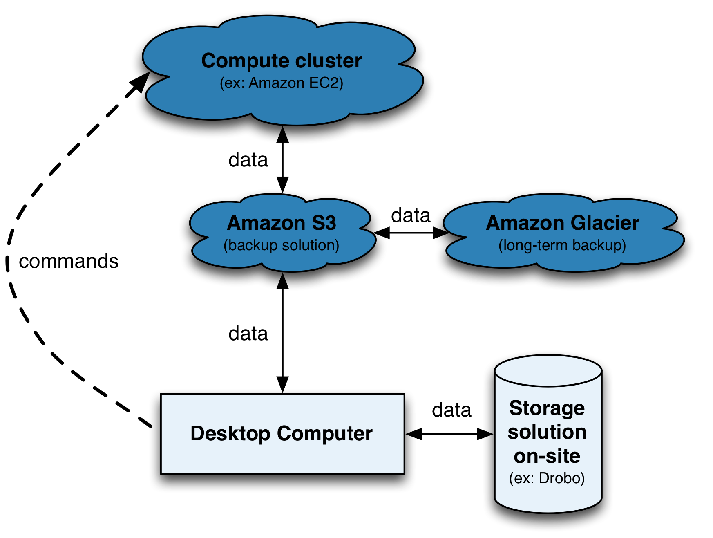

Uploading your GBS data in the cloud
====================================

After trying to download your Illumina lanes to your computer or university computer clusters, you now finally understand the meaning of *omic* jargon: **avalanche**, **deluge** and **tsunami**.

Moving biological data around is a challenge and it isn't going away, technologies in the -omic fields are constantly evolving and producing more data... Accessibility, Expendability, Redundancy and Reliability: this is where `Amazon Simple Storage Service (S3) <http://aws.amazon.com/s3/>`_ come in to play.

**Use Amazon S3 as:**

- a middle man for moving data around (e.g. computer <-> s3 <-> Amazon EC2 instances)
- a cheap, out-of-site and in the cloud backup solution (more on this later)
- well you're already using Amazon S3 if you have Dropbox or Netflix services... these services are nice GUI front-end of Amazon S3!

.. Note:: 

 **Vocabulary specific for Amazon S3:** In kitchens, you have cabinets with drawers filled with kitchen tools. In computers, you have directories with folders filled with files. With Amazon S3 you have **buckets** filled with **objects**. The object can be any files: music, photos or .fastq files! 

 You're not charged for creating buckets, only for the content you put in the buckets. Do you want to keep originals and use Amazon S3 as a backup? Use the *Reduced Redundancy Storage (RRS)* feature to reduce the cost, by 20%, of storage on Amazon S3. 
 
 Data transfer IN Amazon S3 : FREE
 Data transfer OUT Amazon S3 TO Amazon EC2 in your region: FREE
 Data transfer OUT Amazon S3 TO your computer: first 1 GB/month FREE, up to 10 TB/month: 0.12$/GB. If your GBS analysis output 4 GB of data you will pay 0.36$ to get the data.  For more details see `documentation <http://aws.amazon.com/s3/>`_ and `pricing <http://aws.amazon.com/s3/pricing/>`_.
 
 For GBS data archiving, see `Amazon Glacier <https://aws.amazon.com/glacier/>`_. 
 
 
 For easy on-site storage solutions for next-generation sequencing data, see `drobo <http://www.drobo.com>`_.
 
 

Upload data with your browser
-----------------------------

1. `Start here <http://docs.aws.amazon.com/AmazonS3/latest/gsg/GetStartedWithS3.html>`_
2. Manage your S3 buckets/objects directly from your `browser <https://console.aws.amazon.com/s3>`_.

.. Note::

 **Get the most out of Amazon S3**: with the free application `Cyberduck <http://cyberduck.io>`_ to view your Amazon S3 bucket content, transfer files or synchronize transfer between your Mac and your bucket (here's the `Cyberduck-Amazon S3 how to <https://trac.cyberduck.io/wiki/help/en/howto/s3>`_ and `Cyberduck's Quick Refence Guide <https://trac.cyberduck.io/raw-attachment/wiki/help/en/Cyberduck%20Quick%20Reference.pdf>`_). Or use `transmit <https://panic.com/transmit/>`_ to mount your S3 bucket like an external drive on your Mac desktop . Linux users will find `FileZilla <https://filezilla-project.org>`_ very useful.
 
 We haven't found a GUI application, apart from the Amazon Java applet (through your browser), that supports transferring large files like those produced by Illumina or Ion Torrent sequencers. Transferring individual fastq files will work, but for your entire flowcells and lanes, you need something more useful...

Upload data using the Terminal
------------------------------
The Terminal is much more powerful for uploading large files to your new Amazon S3 bucket. We will use Python's built in multiprocessing module that takes advantage of `multipart upload <http://docs.aws.amazon.com/AmazonS3/latest/dev/mpuoverview.html>`_ of Amazon and `boto <http://boto.readthedocs.org>`_. To make uploading your data less painful, the script uploads, in parallel, chunks of your huge files.

1. Configure **boto** with your Amazon credentials:

.. code-block:: bash

 sudo mkdir ~/.EC2                  # create a folder in your home directory
 sudo nano ~/.EC2/boto.cfg          # create a new file

.. code-block:: bash

 # Copy and paste the text below in your new nano boto.cfg file:
 [Credentials]
 aws_access_key_id = your-access-key
 aws_secret_access_key = your-secret-key
 
.. code-block:: bash

 crtl-o                                   # to write the change to the file
 crtl-x                                   # to exit nano editor
 sudo chmod 600 ~/.EC2/boto.cfg           # put restriction on the file

You want to include the BOTO_CONFIG environment variable definition in your shell start up script so that boto knows where to look for the Amazon credentials (boto.cfg) every time you log in or spawn a new shell.

Use *nano*, *vim* or *TextWrangler* to copy/paste ``export BOTO_CONFIG="/Users/thierry/.EC2/boto.cfg"`` to your .bash_profile file. Afterwards, don't forget to reload the shell start up script in the Terminal:

.. code-block:: bash

 source ~/.bash_profile

2. :download:`Download the Python script <s3_multipart_upload.py>`. For more information on the script, `see Brad Chapman Github page <https://github.com/chapmanb>`_. Move the script to your **programs** folder and edit/comment/uncomment for your needs this part: 

.. code-block:: bash

 file="~/Document/GBS_lane.fastq.gz"  # path-to-file-to-transfer
 bucket="gbs_data"                    # bucket name
 num_cores="8"                        # number of cores to use for upload.

 #norr="--norr"                        # no reduced redundancy storage
 public="--public"                    # make uploaded files public.

To run the script and start transferring your file:

.. code-block:: bash

 s3_multipart_upload.py $file $bucket $norr $public --cores=$num_cores

.. Note::

 **Further Amazon S3 readings:**
 
 `Quick Reference Card <http://awsdocs.s3.amazonaws.com/S3/latest/s3-qrc.pdf>`_
 | `Amazon S3 Documentation <http://aws.amazon.com/documentation/s3/>`_
 | `How to backup and store NGS data <http://www.molecularecologist.com/2013/08/how-to-backup-and-store-your-next-generation-sequencing-ngs-data/>`_
 | `FAQ <http://aws.amazon.com/s3/faqs/>`_
