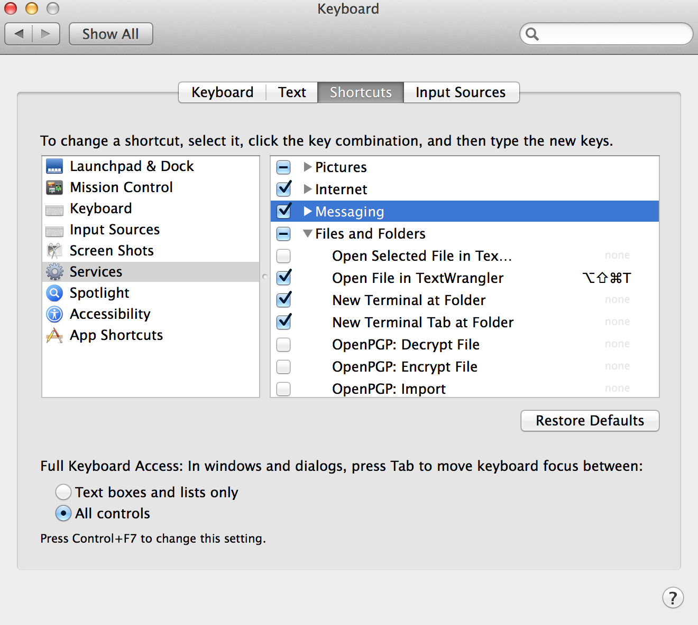

Useful
======

Update `Github <http://en.wikipedia.org/wiki/Github>`_
------------------------------------------------------
Mac OSX comes with `Github <https://github.com
>`_,a Version Control System (VCS), pre-installed with Mavericks. However, the install is in /usr/bin/git which makes it difficult for beginners to update. To change this, run these commands:

1. Install `GNU Autoconf <http://www.gnu.org/software/autoconf/>`_

.. code-block:: bash

 cd ~/Downloads
 wget http://ftp.gnu.org/gnu/autoconf/autoconf-latest.tar.gz
 tar -xvzf autoconf-latest.tar.gz
 cd autoconf-2.69
 ./configure
 make
 sudo make install
 cd .. 
 sudo rm -R ~/Downloads/autoconf-*

2. Install Github

.. code-block:: bash

 git --version      # show current git version installed
 which git          # returns where is git on your computer
 cd ~/Downloads
 git clone https://github.com/git/git # install the latest Git
 cd git
 make configure
 ./configure
 make
 sudo make install
 cd .. 
 sudo rm -R ~/Downloads/git/     # remove git folder
 sudo rm /usr/bin/git*           # remove all the git tools previously installed
 source ~/.bash_profile          # reload startup script
 git --version                   # confirmed the version you just installed
 which git                       # returns /usr/local/bin

Make your s3 drive mount on reboot
----------------------------------

1. Creates a new batch file called **automount-s3** containing the s3fs command to mount your S3 bucket:
2. Move the newly created file to location “/usr/sbin”
3. Change ownership of file to root:root
4. Change permissions of file to +x (executable)
5. Reboot your system and check that the script actually works

.. code-block:: bash

 echo "s3fs bucket_name -o allow_other /media/s3" >> automount-s3
 sudo mv automount-s3 /usr/sbin
 sudo chown root:root /usr/sbin/automount-s3
 sudo chmod +x /usr/sbin/automount-s3
 sudo reboot   # to reboot the EC2 Instance

After reboot is complete, connect to your instance and run the executable file

.. code-block:: bash

 instance="ec2-54-87-41-96.compute-1.amazonaws.com"        # public DNS
 keypair_path="/Users/thierry/Downloads/GBS_keypair.pem"   # path to your key pair
 ssh -i $keypair_path ec2-user@$instance                   # to start the connection

 sudo -i  # become root and keep sudo privilege
 sudo /usr/sbin/automount-s3
 df -h # see if disk is mounted and command successful
 
Open Terminal from specific folder
----------------------------------

In System Preferences choose Keyboard -> Shortcuts. From the left panel, choose **Services**. In the right panel, under **Files and Folders**, choose **New Terminal at Folder and/or New Terminal Tab at Folder**. Now you can right-click your track pad or mouse on a folder and choose Services -> New Terminal at Folder!

